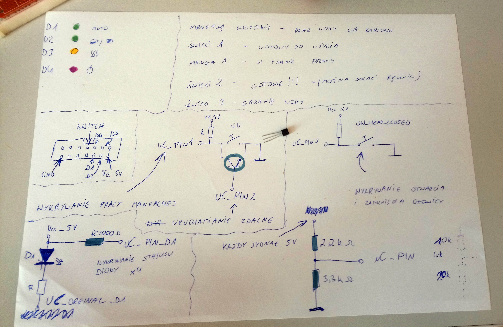

# HA_LAN_Coffe_Machine
[ESP32] [Micropython] Sterownik/rozszerzenie do ekspresu do kawy - Braun Tassimo

Urządzenie współpracuje z serwerem Home Assistant.

### Funkcjonalności
- Aktywacja parzenia kawy przez sieć LAN (np. z poziomu aplikacji android) - serwer HomeAssistant
- Zabezpieczenie przed zrobieniem kawy z tej samej kapsułki
- Informowanie o zakończeniu procesu parzenia kawy
- Możliwość zaprogramowania godziny parzenia kawy z poziomu serwera HomeAssistant
- Obsługa WebREPL - komunikacja i programowanie zdalne przez sieć

Całość napisana w języku MicroPython

### Sposób działania

ESP32 monitoruje stan diód LED dostępnych na panelu ekspresu i na ich podstawie określa co aktualnie robi urządzenie.

Uruchomione dwa wątki systemowe - jeden odpowiedzialny za komunikację sieciową, a drugi obsługujący 'komunikację' z ekspresem.

