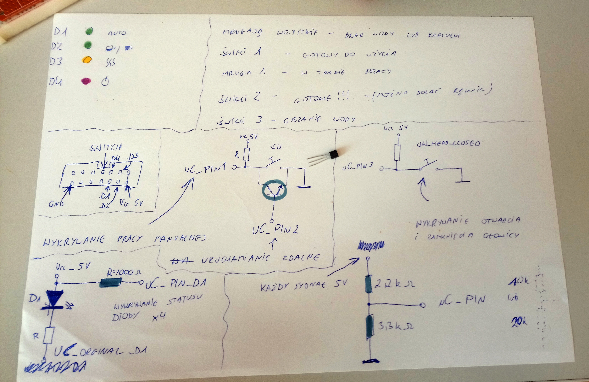

# HA_LAN_Coffee_Machine

[ESP32] [MicroPython] Controller / extension for a Braun Tassimo coffee machine.

The device integrates with a Home Assistant server.

### Features

- Coffee brewing activation over LAN (e.g. from an Android application via the Home Assistant server)
- Protection against brewing coffee twice using the same capsule
- Notification when the brewing process is complete
- Ability to schedule coffee brewing from the Home Assistant server
- WebREPL support – remote communication and programming over the network

The entire project is written in MicroPython.

### How It Works

The ESP32 monitors the state of the LEDs available on the coffee machine's control panel and uses them to determine the current state of the machine.

Two system threads are running simultaneously – one is responsible for network communication, while the other handles the "communication" with the coffee machine.

